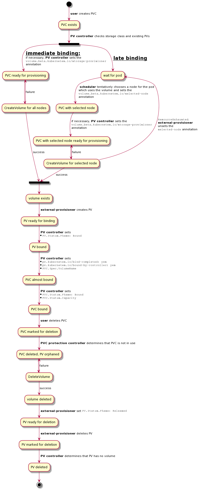

# Design

External-provisioner interacts with Kubernetes by watching PVCs and
PVs and implementing the [external provisioner
protocol](https://github.com/kubernetes/design-proposals-archive/blob/main/storage/container-storage-interface.md#provisioning-and-deleting).
The following diagram illustrates that, starting with the creation of
a PVC by a user and ending with the removal of all resources.

When an object is marked for deletion, actual deletion is delayed
until the controller checks the necessary preconditions for deletion
and removes its finalizer.

Failures are handled by retrying, which is only shown here for
`CreateVolume` calls because it is a bit special: for late binding, a
CSI driver can trigger the re-scheduling of a pod by returning the
special `ResourceExhausted` gRPC status code.

Note that a timed-out `CreateVolume` call does not change any state
and will simply get repeated. If the CSI driver has completed volume
creation in the meantime, it must recognize the repeated call and
return information about it ("idempotency"). All gRPC calls have to be
idempotent.

How the selected node is communicated to the CSI driver is explained
in the [topology](../README.md#topology-support) section.
